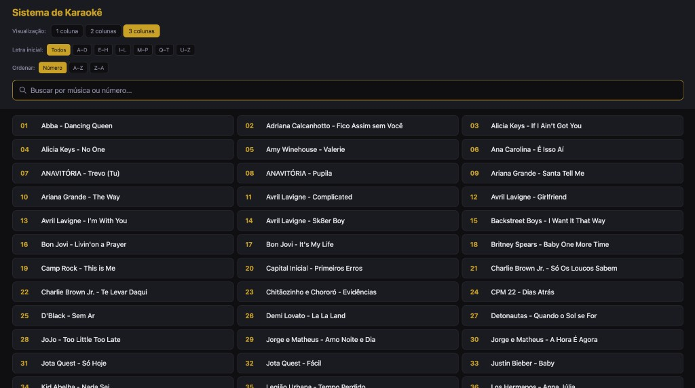
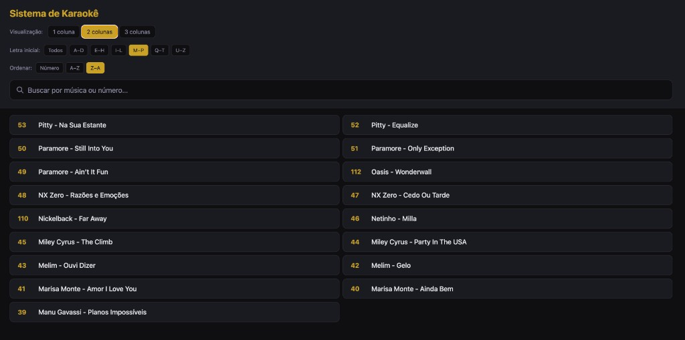

# Sistema de Karaokê

Sistema simples para listar e reproduzir vídeos de karaokê: **tela cheia** na lista e **tela cheia** no vídeo. Se houver um monitor ou projetor conectado via **HDMI**, o vídeo abre automaticamente em tela cheia na tela conectada, enquanto a lista continua no seu computador.



A tela principal mostra todas as músicas da pasta `songs/`: busca por nome ou número, filtro por letra inicial (A–D, E–H, etc.), ordenação por número ou A–Z/Z–A e visualização em 1, 2 ou 3 colunas. Clique em uma música e o vídeo abre em tela cheia.



Você pode filtrar por letra (ex.: M–P), ordenar por A–Z ou Z–A e escolher 1, 2 ou 3 colunas. O vídeo sempre abre em **tela cheia**; com HDMI conectado, vai para a **segunda tela** (TV ou projetor). Pressione **Esc** na janela do vídeo para fechar.

---

## Estrutura do projeto

```
karaoke-app/
├── main/           # Processo principal (Electron)
├── renderer/       # Janela da lista (index.html, renderer.js, preload.js)
├── player/         # Janela do vídeo (player.html, player-renderer.js, player-preload.js)
├── scripts/        # Utilitários (ex.: geração do PDF da lista)
├── assets/         # Recursos (logo, etc.)
├── build/          # Ícones para build
├── songs/          # Vídeos de karaokê (não versionados)
└── docs/           # Documentação e imagens
```

## O que você precisa

- **Node.js** ([nodejs.org](https://nodejs.org))
- **Vídeos** na pasta `songs/` (dentro do projeto), no formato: `NN - Artista - Nome da Música.mp4`  
  Os vídeos não vêm no repositório. Veja **`songs/LEIA-ME.txt`** para obter a pasta de músicas (e-mail/WhatsApp) ou para adicionar músicas pelo Cursor/yt-dlp.

## Instalação

```bash
git clone https://github.com/hillsong-sao-paulo/karaoke-app.git
cd karaoke-app
npm install
```

## Como rodar

**Pelo Terminal:**
```bash
cd karaoke-app
npm start
```

O app abre **em tela cheia**. A lista fica em um monitor; ao clicar numa música, o vídeo abre em tela cheia (no HDMI, se estiver conectado).

**Duplo clique (macOS):**  
Abra a pasta do projeto e dê dois cliques no arquivo **.command** disponível. O Terminal abre e o app sobe em tela cheia.

> **Se o app fechar na hora ou der erro ao rodar no terminal do Cursor:** use o **Terminal do sistema** (Terminal.app) ou o **.command** — alguns ambientes (ex.: Cursor) definem variáveis que fazem o Electron rodar como Node e o app não inicia.

## Comportamento em tela cheia

| O quê | Comportamento |
|-------|----------------|
| **App (lista)** | Abre em tela cheia no monitor principal. |
| **Vídeo** | Abre em tela cheia. Se houver **HDMI** (segundo monitor/TV/projetor), o vídeo vai para essa tela; senão, abre no mesmo monitor. |
| **Fechar vídeo** | Pressione **Esc** na janela do vídeo. |

## Adicionar novas músicas

- Instruções completas (numeração, comando yt-dlp com Safari ou Chrome): **`docs/regras-adicionar-musicas.md`**
- Resumo: coloque os `.mp4` em `songs/` com o nome `NN - Artista - Música.mp4`; o app e o PDF da lista usam só o que está nessa pasta.

## Lista para impressão (PDF)

O app gera automaticamente o arquivo **`Karaoke-Lista-Impressa.pdf`** ao abrir (lista de todas as músicas de `songs/`). Para gerar só o PDF sem abrir o app:

```bash
npm run pdf
```

## Build (opcional)

Para gerar o executável (.app no macOS):

```bash
npm run build
```

O app fica em `dist/mac-arm64/`. Em algumas versões do macOS o .app pode falhar; nesse caso use `npm start` ou o arquivo `.command`.

## Atalhos

- **Esc** no campo de busca: limpa a busca
- **Esc** na janela do vídeo: fecha a reprodução
- Sair da tela cheia do app: **Cmd+Ctrl+F** ou fechar a janela

## De onde vem a lista

O app lê os arquivos de vídeo (`.mp4`, `.mkv`, `.webm`, `.mov`) da pasta **`songs/`** e extrai número e título do nome do arquivo (`NN - Artista - Música.ext`). Não usa planilha nem banco de dados.
